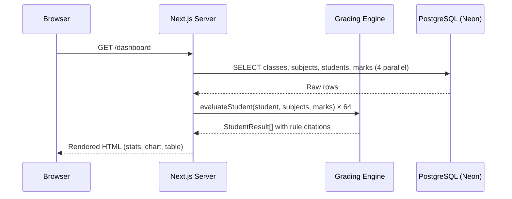
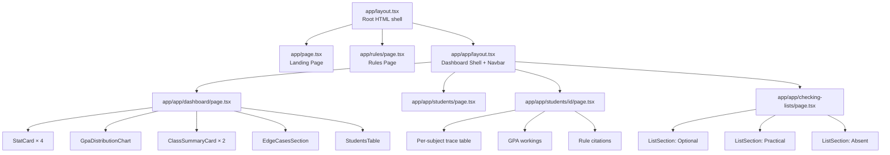
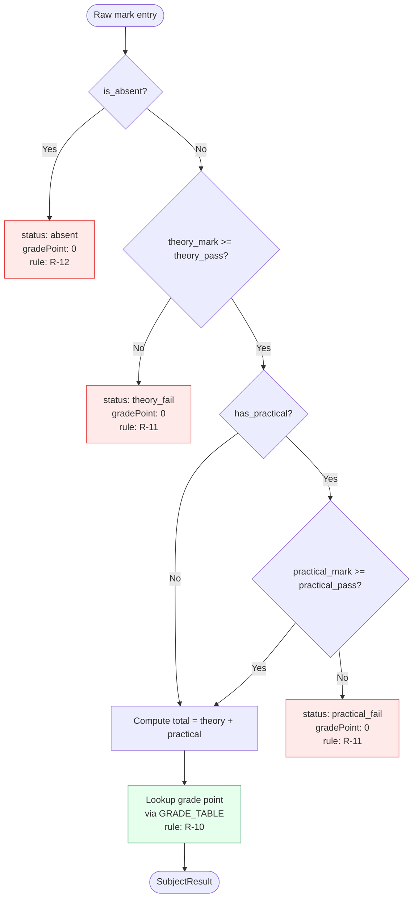
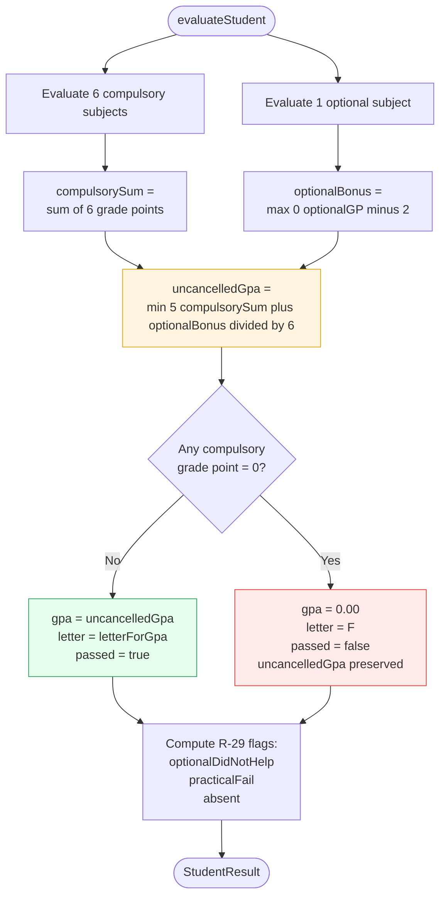
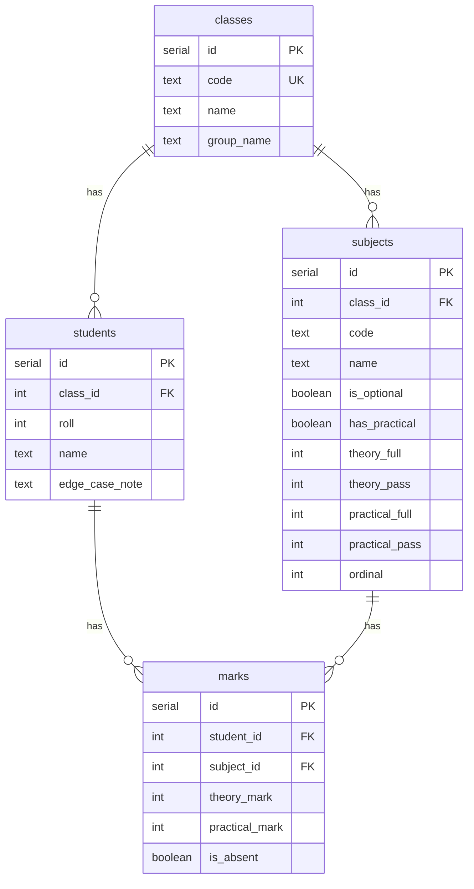

# GradePoint — School Result Processing & GPA Engine 

Solution for **LSH26 Hackathon 2026 — P08**

## Project information

- **Team:** LSH26-T053
- **Team ID:** `LSH26-T053`
- **Problem:** `P08 — School Result Processing and GPA Engine`
- **Live application:** <https://gradepointweb.vercel.app>

## Solution summary

GradePoint is a fully deterministic school result processing system and GPA calculation engine built for Bangladeshi secondary schools. It takes raw mark entries across theory and practical assessments, applies official grade calculation and absence rules on demand, and generates auditable per-student traces alongside dedicated office checking lists. It helps school administrative staff, teachers, and auditors verify grade accuracy without risk of stale cached results.

## Requirements

| Requirement | Status | Where to verify |
| ----------- | ------ | --------------- |
| **R1** — Student cohort & edge cases (Science & Business classes, theory/practical split marks) | Complete | `db/schema.sql`, `db/seed.sql`, `scripts/seed.mjs` — 64 students across 2 classes with 10 hand-written edge cases |
| **R2** — Grade calculation engine (R-10 mark table, R-11 pass rules, R-12 absence, R-13 GPA formula) | Complete | `lib/grading.ts` (`evaluateSubject`, `evaluateStudent`), verified offline via `npm run verify` |
| **R3** — Per-student calculation trace | Complete | `/students/[id]` (`app/(app)/students/[id]/page.tsx`) — detailed mark breakdown, bonus workings, and rule citations |
| **R4** — Office checking lists (R-29 optional <=2.0, practical fail <8, absent AB) | Complete | `/checking-lists` (`app/(app)/checking-lists/page.tsx`) — categorized office verification lists |

## How to test the application

1. Open the live application at <https://gradepointweb.vercel.app>.
2. Click **Open dashboard** to access the cohort results overview, GPA distribution chart, class summary cards, and student roster.
3. Click **Open checking lists** (or navigate to `/checking-lists`) to inspect students flagged for optional subject non-contribution, practical failures, or absences.
4. Click on any student row in the roster (e.g. Roll 1 / Student ID 1) to view their step-by-step calculation trace showing the exact rule IDs (`R-10`, `R-11`, `R-12`, `R-13`) cited for every mark and GPA decision.

### Test or sample data

- **Published Fixture**: The application automatically loads a 64-student cohort across 2 classes (Science & Business Studies) stored in PostgreSQL (Neon serverless).
- **Hand-written Edge Cases**: 10 dedicated edge-case students (e.g., strong average with 1 fail, practical fail behind passing theory mark, optional GP <=2.0, compulsory absence vs optional absence, GPA cap at 5.00) are seeded to exercise all rule boundaries.
- **Reset Instructions**: Run `npm run db:seed` (or execute `db/seed.sql`) to restore the database to its initial published state.

## Problem-solving approach

- **Understanding the Problem**: Bangladeshi secondary school result evaluation requires strict rule execution across component-level marks (theory vs. practical), subject classification (compulsory vs. optional), GPA calculations with bonus caps, failure cancellations, and auditing flags.
- **Chosen Solution**: Designed a pure, deterministic TypeScript grading engine (`lib/grading.ts`) where marks are the sole source of truth in PostgreSQL, and all derived grade points, GPAs, and office checking flags are computed dynamically on demand.
- **Key Technical Decision**: **Zero stored derived state**. By keeping database schema limited strictly to raw marks and calculating results at read time, any mark entry update immediately propagates across all views without risks of stale cached data. Furthermore, every evaluation step attaches an explicit rule ID (`R-10`, `R-11`, `R-12`, `R-13`, `R-29`) for complete auditability.
- **Testing & Verification**: Built an offline test suite (`scripts/verify.ts`) with 92 assertions covering 10 hand-written edge cases and 13 GPA letter boundary conditions.

## Technology used

- **Frontend:** Next.js 16.3 (React 19, TypeScript), Tailwind CSS v4, DaisyUI v5
- **Backend:** Next.js Server Components, App Router Server Actions
- **Database:** PostgreSQL (Neon serverless in production, node-postgres locally)
- **Deployment:** Vercel
- **Other material tools:** Node.js, Bun, Figma asset export pipeline (`scripts/fetch-figma-assets.mjs`)

See [`LICENSES.md`](LICENSES.md) for third-party materials.

## Run locally

### Requirements

- Node.js 20+ (or Bun)
- PostgreSQL database (e.g. [Neon](https://neon.tech) serverless or local Postgres)

### Setup

```bash
git clone https://github.com/mihf05/LSH26-T053-P08.git
cd LSH26-T053-P08
npm install
cp .env.example .env.local
# Set DATABASE_URL in .env.local
npm run db:seed
npm run dev
```

Do not include real passwords, tokens or API keys. List only variable names in `.env.example`.

---

## Table of Contents

1. [Architecture](#architecture)
2. [Grading Rules Reference](#grading-rules-reference)
3. [Application Pages](#application-pages)
4. [Database Schema](#database-schema)
5. [Project Structure](#project-structure)
6. [Data & Seed](#data--seed)
7. [Verification Suite](#verification-suite)
8. [Team contributions](#team-contributions)
9. [AI usage](#ai-usage)
10. [Major design decisions](#major-design-decisions)
11. [Known limitations](#known-limitations)
12. [Repository records](#repository-records)
13. [License](#license)

---

## Architecture

### High-Level Data Flow



### Component Architecture



### Grading Engine Internals





---

## Grading Rules Reference

All rules are implemented in [`lib/grading.ts`](lib/grading.ts) and cited in every result trace.

### R-10 — Mark Scale & Grade Points

Subject grade points are determined from total marks out of 100:

| Marks Range | Grade Point | Letter |
|-------------|-------------|--------|
| 80 – 100    | 5.00        | A+     |
| 70 – 79     | 4.00        | A      |
| 60 – 69     | 3.50        | A-     |
| 50 – 59     | 3.00        | B      |
| 40 – 49     | 2.00        | C      |
| 33 – 39     | 1.00        | D      |
| 0 – 32      | 0.00        | F      |

Final letter grade is mapped from the computed GPA:

| GPA Range   | Letter |
|-------------|--------|
| 5.00        | A+     |
| 4.00 – 4.99 | A      |
| 3.50 – 3.99 | A-     |
| 3.00 – 3.49 | B      |
| 2.00 – 2.99 | C      |
| 1.00 – 1.99 | D      |
| < 1.00      | F      |

### R-11 — Theory & Practical Pass Marks

| Subject type     | Theory full | Theory pass | Practical full | Practical pass |
|-----------------|-------------|-------------|----------------|----------------|
| With practical  | 75          | 25          | 25             | 8              |
| Without practical | 100        | 33          | —              | —              |

Failing **either** component (theory or practical) independently fails the whole subject at **0.00 grade points**, regardless of the total score.

### R-12 — Absence Handling

- **Compulsory subject absent (AB):** Grade point = 0.00; **cancels overall result to F**
- **Optional subject absent (AB):** Grade point = 0.00; student is **flagged for office review only** (does not cancel GPA unless a compulsory subject also fails)

### R-13 — GPA Formula & Cancellation

```
GPA = min(5.00,  (sum of 6 compulsory grade points  +  max(0, optional GP − 2))  /  6 )
```

- Result is rounded to 2 decimal places (half-up)
- If **any** compulsory subject has grade point 0 (fail, theory fail, practical fail, or absent), the final GPA is **cancelled to 0.00 (F)**
- The *uncancelled* GPA is always preserved and displayed for auditing

### R-29 — Office Checking Lists

Students are automatically flagged and placed on checking lists when:

| Flag | Condition |
|------|-----------|
| `optionalDidNotHelp` | Optional subject GP ≤ 2.00 (or absent) |
| `practicalFail`      | Any subject's practical mark < 8 |
| `absent`             | Marked absent (AB) in any subject |

Flags can overlap. A student can appear on all three lists simultaneously.

---

## Application Pages

### Landing Page (`/`)
The public-facing home page built to the Figma design, with gradient hero, feature cards, values section, and call-to-action. Navigation links to **Dashboard** and **Rules** only.

### Rules Page (`/rules`)
A full reference of all five grading rules, both lookup tables (mark → grade point, GPA → letter), and an explanatory footer. Uses the same landing page layout and gradient treatment for visual consistency.

### Dashboard (`/dashboard`)
The main result overview for authorised users:
- **4 stat cards:** Total students, passed count with pass rate, mean GPA of passing students, and the count needing checking
- **GPA distribution chart:** Grouped bar chart showing grade distribution by letter
- **Class summary cards:** Pass/fail breakdown per class
- **Edge cases section:** Highlights the 10 hand-written edge case students and the total flagged count
- **Full student roster table:** Sortable and filterable by class, outcome, and flag with direct links to individual traces

### Student Detail (`/students/[id]`)
A step-by-step calculation trace for a single student:
- Mark sheet with display marks (e.g. `72 (55T + 17P)` or `AB`)
- Subject grade point and letter with the rule that decided it
- GPA workings block showing the full arithmetic
- Any active checking-list flags with their explanations

### Checking Lists (`/checking-lists`)
Three distinct sections driven by R-29:
- **Optional did not help** — students whose optional GP ≤ 2.00
- **Practical fail** — students with a practical mark under the pass threshold
- **Absent** — students marked AB in any subject

Each section shows a table with roll, name, class, and the relevant detail, plus a human-readable description of what the office should verify.

### Students List (`/students`)
Paginated list of all students with quick-filter entry points.

---

## Database Schema

The database stores **only raw marks**. Nothing derived is ever persisted.

```sql
classes    (id, code, name, group_name)
  └─ subjects  (id, class_id, code, name, is_optional, has_practical,
                theory_full, theory_pass, practical_full, practical_pass, ordinal)
  └─ students  (id, class_id, roll, name, edge_case_note)
       └─ marks (id, student_id, subject_id,
                 theory_mark, practical_mark, is_absent)
```



**Key constraint:** The `marks_absent_has_no_marks` check constraint ensures that `is_absent = true` rows must have `NULL` for both `theory_mark` and `practical_mark`, preventing inconsistent data at the database level.

---

## Project Structure

```
LSH26-T053-P08/
├── app/
│   ├── page.tsx                    # Landing page (public)
│   ├── layout.tsx                  # Root layout (fonts, globals)
│   ├── globals.css                 # Design tokens and utility classes
│   ├── rules/
│   │   └── page.tsx                # Rules reference page (public)
│   └── (app)/                      # Dashboard route group (Navbar layout)
│       ├── layout.tsx              # Dashboard shell with Navbar
│       ├── loading.tsx             # Full-screen loading state
│       ├── error.tsx               # Error boundary
│       ├── dashboard/
│       │   └── page.tsx            # Stats, chart, table, edge cases
│       ├── students/
│       │   ├── page.tsx            # Paginated student list
│       │   └── [id]/
│       │       └── page.tsx        # Per-student calculation trace
│       └── checking-lists/
│           └── page.tsx            # R-29 three office checking lists
│
├── components/
│   ├── Navbar.tsx                  # Dashboard navigation bar
│   ├── PageHeader.tsx              # Reusable page/section header
│   ├── StatCard.tsx                # Metric display card
│   ├── GpaDistributionChart.tsx    # Bar chart of grade distribution
│   ├── ClassSummaryCard.tsx        # Per-class pass/fail summary
│   ├── EdgeCasesSection.tsx        # Edge case students callout
│   ├── StudentsTable.tsx           # Filterable student roster table
│   ├── ListSection.tsx             # Checking list section component
│   ├── GradeBadge.tsx              # Coloured letter grade badge
│   ├── Pagination.tsx              # Reusable pagination control
│   ├── ThemeSwitcher.tsx           # Light/dark theme toggle
│   └── landing/
│       ├── LandingNav.tsx          # Public landing page navigation
│       └── Buttons.tsx             # Primary/secondary CTA buttons
│
├── lib/
│   ├── grading.ts                  # Pure grading engine (THE core)
│   ├── queries.ts                  # DB → engine → ResultSet pipeline
│   ├── db.ts                       # Neon / pg dual-driver database client
│   ├── themes.ts                   # Theme definitions
│   └── landing-assets.ts           # Figma asset path helpers
│
├── db/
│   ├── schema.sql                  # Table definitions (drop + create)
│   └── seed.sql                    # 64 students, 10 hand-crafted edge cases
│
├── scripts/
│   ├── seed.mjs                    # Node.js seed runner (npm run db:seed)
│   ├── verify.ts                   # 92-assertion engine test suite
│   └── fetch-figma-assets.mjs      # Downloads landing page assets from Figma
│
├── public/                         # Static assets (landing images, icons)
├── evaluation-manifest.json        # Hackathon evaluation metadata
├── LICENSES.md                     # Third-party assets and AI disclosures
├── Event.md                        # Event start record (pre-existing materials)
└── package.json
```

---

## Data & Seed

### Cohort

| Class            | Group           | Students | Compulsory subjects | Optional subject  |
|-----------------|-----------------|----------|---------------------|-------------------|
| Science          | Science         | 32       | Bangla, English, Mathematics, Physics, Chemistry, Biology | Higher Mathematics |
| Business Studies | Business        | 32       | Bangla, English, Mathematics, Accounting, Business Entrepreneurship, ICT | Agriculture Studies |

### Edge Cases

Ten students were hand-crafted to exercise every significant rule boundary. Each has an `edge_case_note` that appears in the dashboard's Edge Cases section:

| # | Case name | Rules exercised |
|---|-----------|-----------------|
| 1 | One failed subject on a strong average | R-11, R-13 (cancellation) |
| 2 | Practical fail behind a passing theory mark | R-11 (practical), R-29 |
| 3 | Optional subject below the point where it helps | R-13 (bonus = 0), R-29 |
| 4 | Absent in a compulsory subject | R-12 (compulsory AB), R-13 |
| 5 | Absent in the optional subject | R-12 (optional AB), R-29 |
| 6 | GPA capped at 5.00 | R-13 (cap) |
| 7 | Exactly on both pass marks (theory 25, practical 8) | R-11 (boundary) |
| 8 | Practical one mark short of the pass mark | R-11 (practical boundary) |
| 9 | Optional grade point 1.00 still goes on the list | R-29 |
| 10 | On all three checking lists at once | R-29 (all flags), R-11, R-12, R-13 |

---

## Verification Suite

`scripts/verify.ts` is an offline test suite that runs the grading engine against all 10 edge case fixtures with hand-computed expected values. It uses Node.js's built-in `assert/strict` and requires no test framework.

**92 assertions** cover:
- Final GPA (2 decimal places)
- Uncancelled GPA (preserved when cancelled)
- Letter grade
- Passed / failed flag
- Optional bonus value
- Individual checking-list flags (`optionalDidNotHelp`, `practicalFail`, `absent`)
- The specific subject(s) that cancelled the GPA (`cancelledBy`)
- The rule ID prefix on the relevant subject trace (`rulePrefix`)
- GPA cancellation impacts text mentions `Uncancelled GPA`

```bash
npm run verify
# OK -- 10 edge cases, 92 assertions passed.
```

---

## Team contributions

| Registered member | GitHub username | Major contribution | Evidence |
| ----------------- | --------------- | ------------------ | -------- |
| Md Irfan Hasan Fahim | `mihf05` | Full-stack architecture, pure grading engine (`lib/grading.ts`), database schema & seed scripts, rule verification suite, query pipeline, application page logic | `lib/`, `scripts/`, `db/`, `app/` |
| Atia Farha | `Atia-Farha` | Frontend design, page layouts, components styling, theme system, UI verification | `components/`, `app/globals.css`, `app/rules/` |

---

## AI usage

| Tool | Usage | Verification |
| ---- | ----- | ------------ |
| **Antigravity IDE** | Code generation (component scaffolding, page layouts, CSS design tokens), styling refinement, verification script creation, and documentation | Executed `npm run verify` (92 assertions across 10 edge cases), static analysis, and full production build checks (`npm run build`) |
| **Claude Code** | Architectural refactoring, command proxy optimizations for terminal efficiency, and code review | Verified via Next.js Turbopack compiler, static analysis, and terminal command execution |

---

## Major design decisions

- **Decision:** **Dynamic calculation over database persistence**. Marks are stored raw; grade points, GPAs, letter grades, and office checking lists are derived dynamically on every request. This prevents data inconsistency or stale result bugs when mark corrections occur.
- **Decision:** **Rule-cited calculation trace**. Every evaluation function attaches human-readable explanation strings with explicit rule IDs (`R-10`, `R-11`, `R-12`, `R-13`, `R-29`) directly to the result objects so users can audit any grade decision back to its governing rule.

---

## Known limitations

- Subject mark evaluation tables currently assume standard 100-mark full score breakdown (80+ A+, 70-79 A, 60-69 A-, 50-59 B, 40-49 C, 33-39 D, <33 F).

---

## Repository records

- [`EVENT.md`](EVENT.md) — event start code and pre-event-material declaration
- [`evaluation-manifest.json`](evaluation-manifest.json) — structured judging evidence
- [`LICENSES.md`](LICENSES.md) — frameworks, libraries, templates and assets

---

## License

This project is licensed under the **Apache License 2.0** — see [LICENSE](LICENSE) for the full text.
